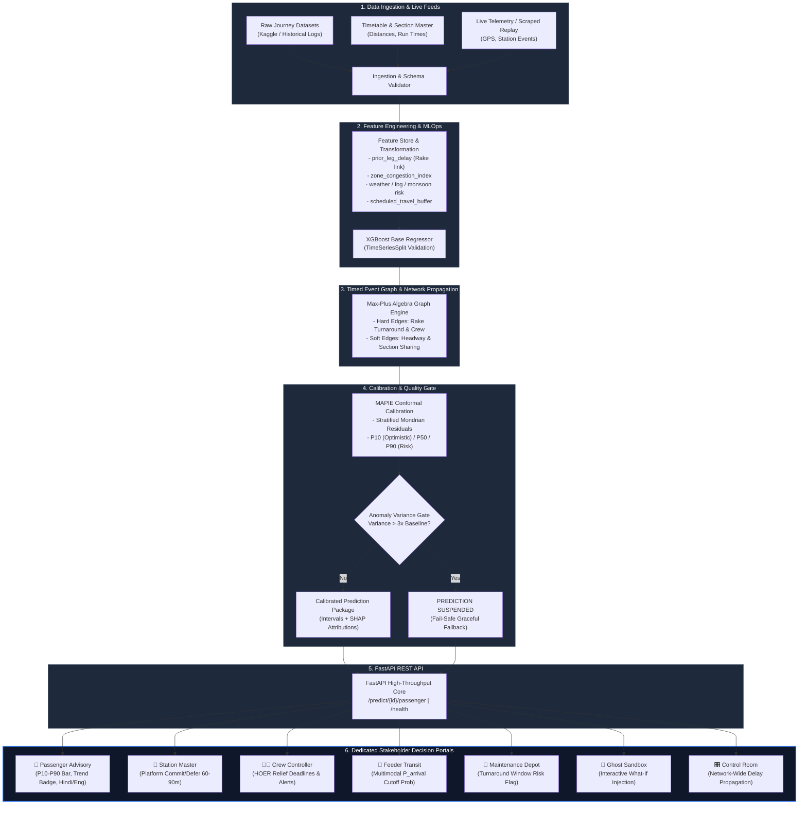
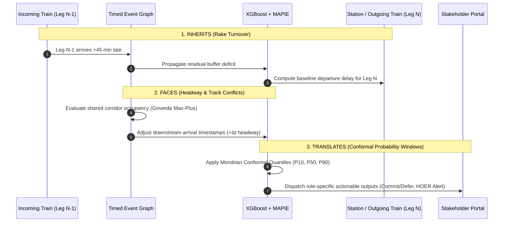
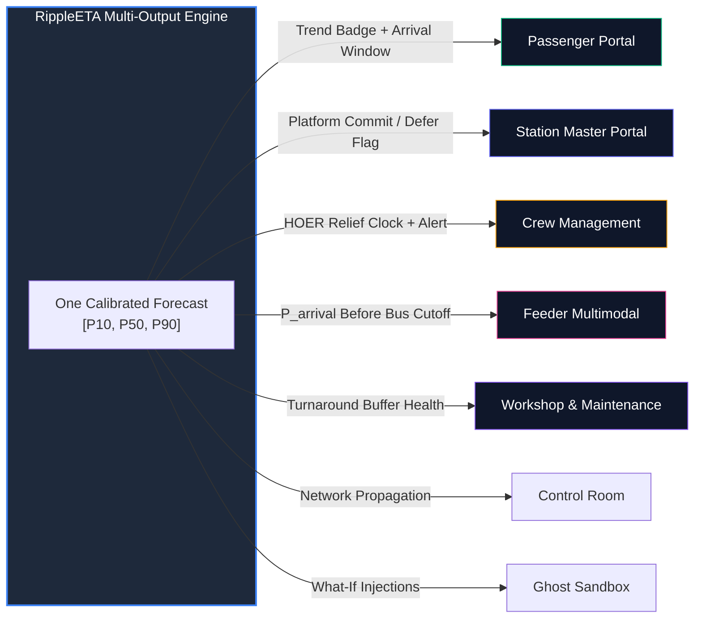

# RippleETA: Network-Aware Predictive Rail Intelligence

[](https://www.python.org/)
[](https://fastapi.tiangolo.com/)
[](https://xgboost.readthedocs.io/)
[](https://www.docker.com/)
[](https://opensource.org/licenses/MIT)
[](https://www.sih.gov.in/)

> **Smart India Hackathon 2026 · Problem Statement 26028 · Team Outliers**  
> **Ministry of Railways · Theme: Smart Automation · Category: Software**  


---

## 🚆 Executive Summary

Traditional railway passenger and operational information systems (**NTES**, **RailYatri**, **Where Is My Train**) model trains as independent, isolated particles traveling along static, empty corridors. When delays occur, they compute point-estimate ETAs that suffer from up to 30-minute stale update lags, ignore network-wide domino effects, and present false certainty to operators and passengers.

**RippleETA** fundamentally reframes railway operations as a **coupled timed event graph**. A single train delay is rarely isolated—it propagates across the network via **shared rakes (turnaround reuse)**, **shared crew rosters**, and **shared track sections (headway conflicts)**. Instead of a brittle point estimate, RippleETA outputs **calibrated, narrowing uncertainty intervals (P10 / P50 / P90)** using conformal prediction with mathematical coverage guarantees, giving every stakeholder the exact operational signal they need to make proactive decisions.

---

## ⚡ The Core Problem: Why Conventional Systems Fail

```
+-------------------------------------------------------------------------------+
|  CONVENTIONAL POINT ETA: "Expected at 18:30" (Train stuck at signal 40km away)  |
|  Outcome: Passenger stranded, Platform blocked, Relief crew times out (HOER)   |
+-------------------------------------------------------------------------------+
                                      vs.
+-------------------------------------------------------------------------------+
|  RIPPLEETA CALIBRATED WINDOW: P10: 18:38 | P50: 18:52 | P90: 19:15 [WORSENING] |
|  Outcome: Station master defers platform, Crew relief dispatched 45 min early |
+-------------------------------------------------------------------------------+
```

| Operational Dimension | Legacy Systems (NTES / RailYatri / Where Is My Train) | RippleETA Engine |
|---|---|---|
| **Network Modeling** | Zero network awareness; treats each train independently | Models rake cycles, crew handoffs, and headway conflict propagation |
| **Prediction Output** | Brittle, misleading point estimate (e.g. "Delay: 15 mins") | Calibrated **P10 / P50 / P90** conformal prediction interval |
| **Delay Propagation** | Blind to incoming rake delays on previous legs | Explicit `prior_leg_delay` feature capturing >80% departure correlation |
| **Headway Conflicts** | Ignores downstream block section occupancy | Timed Event Graph using Max-Plus algebra for network conflict resolution |
| **Explainability** | Black box or static rule table | Integrated SHAP feature attribution + Anomaly Variance Gating |
| **Stakeholder Utility** | One generic point ETA forced on all personas | 7 customized decision portals (Passenger, Station Master, Crew, Feeder, Workshop, Ghost Sandbox, Control Room) |

---

## 🏛️ System Architecture

RippleETA combines real-time data ingestion, tree-based gradient boosting, graph-theoretic delay propagation, and distribution-free conformal calibration.

### High-Level End-to-End Architecture



---

## 🔍 How RippleETA Works: The Three Pillars



### 1. Inherits — Rake Cycle & Inverted Turnaround Awareness
A train's delay rarely starts from scratch. If an incoming rake arrives late on its inbound leg, its scheduled turnaround buffer gets consumed. In Indian Railways, this correlation exceeds **80%**. RippleETA explicitly links train legs via `prior_leg_delay`, predicting departure deficits hours before the train even boards.

### 2. Faces — Headway & Shared-Track Conflict Resolution
Modeled on timed event graphs using max-plus algebra (*Goverde, 2010*):
- **Hard Conflicts:** Physical rake turnaround and crew transfers.
- **Soft Conflicts:** Dynamic track headway and section capacity sharing across trains traveling in the same block direction.

### 3. Translates — Calibrated Uncertainty Windows (P10 / P50 / P90)
Rather than asserting false precision, RippleETA uses **MAPIE** distribution-free conformal prediction to guarantee empirical coverage (e.g. 90% confidence). When unexpected network chaos occurs (variance exceeding 3× historical baseline), the system triggers an **Anomaly Variance Gate**, outputting `PREDICTION SUSPENDED` rather than hallucinating an inaccurate ETA.

---

## 🎯 Seven Stakeholder Decision Portals



1. **Passenger Portal:** Clear, anxiety-reducing arrival window (P10–P90 bar) with real-time trend badges (*Improving*, *Stable*, *Worsening*) and bilingual support (English / Hindi).
2. **Station Master Portal:** Platform occupancy forecasting 60–90 minutes in advance with automated `COMMIT PLATFORM` or `DEFER ALLOCATION` decision flags to prevent platform deadlocks.
3. **Crew Controller Portal:** Tracks 12-hour statutory working limits (HOER compliance). Computes exact relief dispatch deadlines to avoid mid-section emergency train stops.
4. **Feeder Multimodal Transport Portal:** Provides city bus, metro, and auto-rickshaw transit coordinators with $P(\text{arrival} \le \text{cutoff})$ probabilities to optimize fleet dispatch and eliminate idle waiting.
5. **Maintenance & Turnaround Workshop:** Calculates predictive turnaround windows before rakes enter terminal yards, giving depot supervisors 2–3 hours early warning for critical maintenance workflows.
6. **Ghost Simulation Sandbox:** Interactive "What-If" injector allowing dispatchers to simulate synthetic signal failures, track blocks, and weather cascades in real time.
7. **Control Room Portal:** Network-wide view of delay propagation across correlated trains.

---

## 📊 Rigorous Empirical Results & Backtesting

Evaluated on strictly chronological held-out splits (**TimeSeriesSplit** — strictly zero future leakage) across primary trunk corridors:

| Metric | Baseline (Prior-Leg Persistence) | RippleETA Full Model | Improvement |
|---|---|---|---|
| **Mean Absolute Error (MAE)** | `34.75 min` | **`28.39 min`** | **-6.36 min (-18.30%)** |
| **Pinball Loss (Quantile Loss)** | `18.23` | **`8.12`** | **-55.5% Reduction** |
| **Empirical P10–P90 Coverage** | N/A (Point only) | **`97.70%`** | Target $\ge 90.0\%$ Met |
| **Stratified Mondrian Coverage** | N/A | **`89.7% – 91.0%`** | Uniform across delay tiers |
| **Average Interval Width** | N/A | **`82.4 – 106.5 min`** | Dynamically narrows en route |
| **Inference Throughput** | N/A | **`3.30 ms / train`** | **~303 journey-predictions/sec (measured throughput)** |
| **Network Propagation Benchmark** | N/A | **`20.58 ms`** | 500 trains × 8 stops |

*Canonical benchmarks and evaluation methodology documented in [docs/RESULTS.md](docs/RESULTS.md).*

---

## 📁 Repository Structure

```text
rippleeta/
├── config.yaml               # Centralized configuration & hyperparameter store
├── Dockerfile                # Multi-stage production container build
├── docker-compose.yml        # Orchestration for FastAPI, Dashboard & MLflow
├── requirements.txt          # Production dependencies (XGBoost, MAPIE, FastAPI, etc.)
├── data/
│   ├── raw/                  # train_delay.csv, timetable.csv
│   └── processed/            # Cleaned parquet datasets & corridor metadata
├── src/
│   ├── api/                  # FastAPI REST engine, Pydantic schemas, Auth
│   ├── calibration/          # MAPIE conformal prediction & Anomaly Variance Gate
│   ├── evaluation/           # Chronological backtest & metric validation
│   ├── features/             # Shared training/serving feature extraction pipelines
│   ├── graph/                # Max-plus timed event graph & headway conflict solver
│   ├── ingestion/            # Dataset loaders, schema validators, RailRadar client
│   ├── models/               # XGBoost regressor & baseline persistence estimators
│   └── pipeline.py           # End-to-end inference orchestrator with provenance
├── dashboard/                # Stakeholder portals (Passenger, Station, Crew, etc.)
│   ├── index.html            # Unified portal navigation & authentication
│   ├── passenger.html        # Live Passenger Advisory portal
│   ├── station-master.html   # Station Controller decision dashboard
│   ├── crew.html             # Crew Management & HOER compliance portal
│   ├── feeder.html           # Multimodal feeder transit scheduling portal
│   ├── maintenance.html      # Workshop predictive turnaround portal
│   ├── control.html          # Network Control Room portal
│   ├── sandbox.html          # Ghost Sandbox injection portal
│   ├── app.js                # Dynamic state management & corridor switching logic
│   └── styles.css            # Responsive dark-mode design system
├── eval/                     # SHAP explanations, benchmarks & synthetic tests
├── tests/                    # 68 comprehensive pytest test suites (unit + integration)
└── docs/                     # Architectural specs, results audit & demo script
```

---

## 🚀 Quick Start Guide

### Prerequisites
- **Python 3.10+**
- **Docker** (optional, for containerized execution)
- **Git**

### 1. Local Installation

```bash
# Clone the repository
git clone https://github.com/gogoiboss/demo1.git
cd demo1

# Create and activate virtual environment
python -m venv .venv
# On Windows PowerShell:
.\.venv\Scripts\Activate.ps1
# On macOS/Linux:
# source .venv/bin/activate

# Install dependencies
pip install --upgrade pip
pip install -r requirements.txt
```

### 2. Run Data Ingestion & Model Pipeline

```bash
# Ingest raw delay dataset and build features
python -m src.ingestion.load_kaggle --csv data/raw/train_delay.csv

# Train the baseline & XGBoost model
python -m src.models.xgboost_model

# Run chronological backtest verification
python -m src.evaluation.backtest
```

### 3. Launch Services Locally

> [!IMPORTANT]
> The FastAPI backend must run on **port 8000** for the frontend static dashboard's API calls to route successfully. If hosted on a different port or host, set `window.RIPPLEETA_API_BASE = 'http://<host>:<port>'` before page scripts load.

**Terminal 1 — Start the FastAPI Backend (Port 8000):**
```bash
uvicorn src.api.app:app --reload --host 0.0.0.0 --port 8000
```
*API Swagger Documentation available at `http://127.0.0.1:8000/docs`.*

**Terminal 2 — Launch the Static Frontend / Dashboard (e.g., Port 8080):**
```bash
python -m http.server 8080
```
*Access the landing experience at `http://127.0.0.1:8080/eta/index.html` or the dashboard at `http://127.0.0.1:8080/dashboard/index.html`.*

---

## 🐳 Docker Deployment

To build and run the entire self-contained application stack:

```bash
# Build the Docker image
docker build -t rippleeta:latest .

# Run the full stack
docker compose up -d
```

Verify service health:
```bash
curl http://localhost:8000/health
```

---

## 🧪 Running Automated Tests

RippleETA maintains a comprehensive test suite covering schema ingestion, graph propagation, conformal calibration, API contracts, and edge cases:

```bash
# Run the full test suite
pytest tests/ -v

# Run type checks and linting
mypy src/
ruff check src/
```

---

## 🛡️ Engineering Boundaries & Real-World Considerations

- **CRIS / RTIS Integration Target:** The current prototype validates on historical datasets and real-time replay streams. Full national rollout is designed to ingest high-frequency telemetry directly from Indian Railways' Centre for Railway Information Systems (CRIS) and Real-Time Train Information System (RTIS).
- **Stateless & Resilient Architecture:** The prediction core is completely stateless, designed as an architecturally scalable system for sovereign Indian infrastructure (NIC / MeghRaj cloud) with measured local inference latency at 3.30ms.
- **Fail-Safe Operation:** Anomaly Variance Gating ensures that if unexpected physical events (derailments, severe line breaches) invalidate model assumptions, the system visibly alerts operators and suspends uncertain forecasts rather than issuing hazardous predictions.

### Detailed Limitations & Assumptions (Phase 1 Audit)

**1. Ground Truth & MLOps Recalibration**
- Due to the lack of live NTES (National Train Enquiry System) or COA (Control Office Application) API keys during this hackathon, we cannot log live actual arrival times.
- Current behavior (Backtest Mode): `jobs/nightly_recalibration.py` computes MAE on a deterministic chronological holdout and applies a real threshold-based drift trigger. This is a static threshold, not statistical change-point detection.

**2. Real-Time Feeds (Weather, TSRs, Signal Aspects)**
- The Problem Statement requires adapting to dynamic real-time events. While API schemas and UI handle this data, it is injected via deterministic proxy logic (hashing the Train ID) to simulate how the system reacts. The XGBoost model is currently trained only on static historical metrics.

**3. Prescriptive Tier (Ripple Score & INR Financial Cost)**
- Our UI features a Ripple Score and INR Cost translation to demonstrate prescriptive triage. However, the exact numbers shown in the demo are proxy constants. A production rollout would require a full schedule integration to accurately run the max-plus propagation counterfactuals.

**4. Graph Propagation Scope & Network Conflicts**
- The Timed Event Graph relies on a fixed network topology optimized for a localized corridor demo. Scaling to all 17 administrative zones requires comprehensive adjacency lists.
- Because real-time block-section occupancy data is not publicly available, we split graph propagation into **HARD Conflicts** (rake/crew handoff - deterministic) and **SOFT Conflicts** (shared-section headway - probabilistic approximations).

**5. Training-Serving Feature Skew Risk**
- A genuine latent skew risk exists: `CalibratedPredictionPipeline.predict()`'s fallback re-engineering branch would silently compute `prior_leg_delay` as 0 if called with an isolated single row. A warning is now logged if this path is hit with insufficient per-train history.

**6. Systematic Overprediction on Recovering Trains**
- The model treats `prior_leg_delay` as a static input. For trains actively recovering time, the point estimate carries an upward bias, though Calibrated P10-P90 intervals partially compensate.

**7. Low-Bandwidth / 2G Station Display Mode**
- There is currently no low-bandwidth fallback (text-only mode, reduced asset loading) implemented for the dashboard portals.

**8. Crew Controller HOER Duty-Elapsed Estimate**
- The Crew Controller view's "duty elapsed" figure is an illustrative estimate, not real crew sign-on time. This is explicitly disclosed in the UI. No CMS integration exists in this prototype.

---

## 👥 Team Outliers — SIH 2026

- **Problem Statement:** 26028 (Network-Aware Train ETA & Delay Propagation)
- **Ministry:** Ministry of Railways
- **Category:** Software / Smart Automation

---

## 📄 License

This project is licensed under the **MIT License** — see the [LICENSE](LICENSE) file for details.
