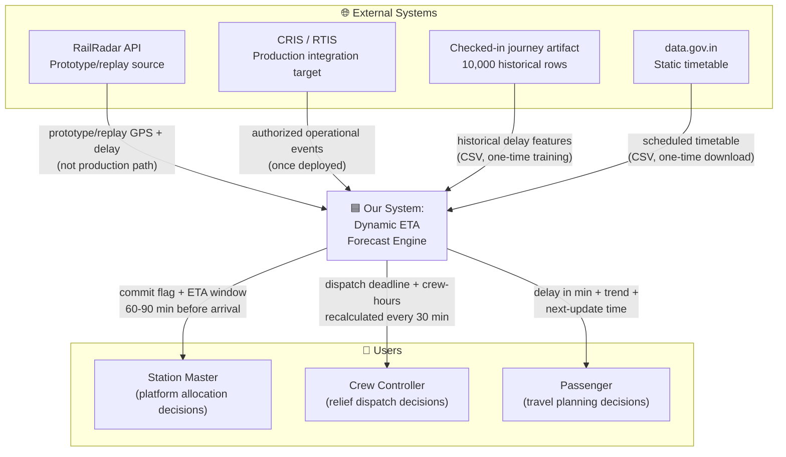
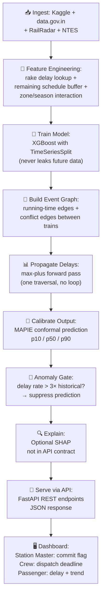

# Technical Approach Slide — Complete Content

## SLIDE HEADLINE (Pyramid Principle — conclusion first)

> **"We don't predict when one train arrives — we predict how its delay spreads across the network."**

---

## 1. Technologies Used (on-slide table)

| Layer | Technology | Why this, not something else |
|---|---|---|
| **Language** | Python 3.10+ | Entire ML/data ecosystem lives here; fastest path to working prototype |
| **Prediction engine** | XGBoost | Tabular delay model evaluated with chronological splits; current runtime does not generate SHAP explanations |
| **Validation** | scikit-learn `TimeSeriesSplit` | Temporal CV — never leaks future data into training; honest accuracy numbers |
| **Network modeling** | NetworkX (Python graph library) | Timed event graph for delay propagation; lightweight, no infra overhead |
| **Calibrated output** | MAPIE (conformal prediction) | Measured 97.7% P10-P90 coverage on 174 held-out rows; interval width is reported |
| **Explainability** | Not in current runtime | Future work: attach feature attribution to each prediction |
| **Drift detection** | Not in current runtime | **Phase 2 roadmap:** monitor rolling error with ADWIN after timetable/infra changes |
| **Auto-retraining** | Not in current runtime | **Phase 2 roadmap:** alert and require frozen-holdout approval; never silently deploy |
| **Live data** | Integration stub only | RailRadar/NTES are prototype sources; production target is CRIS/RTIS once deployed |
| **Historical data** | Checked-in journey artifact (10,000 rows / 56 train numbers) | Reproducible local artifact used by the current demo |
| **Static schedule** | data.gov.in timetable CSV | Official public timetable — baseline for deriving remaining schedule buffer |
| **Live status** | Not connected in current runtime | Future work: ingest actual/scheduled station events |
| **API layer** | FastAPI (Python) | Serves predictions as REST endpoints; auto-generates OpenAPI docs |
| **Dashboard** | HTML · CSS · JavaScript | Passenger, station-controller, and replayed graph prototype views |
| **Infrastructure** | Stateless API; CPU-bound inference | Horizontally scalable on railway-controlled on-premise infrastructure or NIC/MeghRaj; no foreign public cloud dependency |

---

## 2. Methodology — 5-Step Process (on-slide)

> **Read top to bottom: real data in → two novel layers in the middle → decisions out.**

### Step 1 — Ground everything in real data
Load the public historical journey artifact and timetable inputs. RailRadar and scraped NTES are prototype/replay sources; the production integration target is CRIS/RTIS once deployed. The current demo does not claim live production positions. Derive **remaining schedule buffer** where timetable fields are available.

### Step 2 — Predict the delay, tested the way it'll actually be used
XGBoost trained on past data, **always validated forward in time** (`TimeSeriesSplit` — not random shuffle, which inflates accuracy by 5–10 points). Two novel features drive most value:
- **Late incoming rake** — prior-leg delay lookup; its measured value is reported only where evaluated
- **Remaining schedule buffer** — derivable from public timetable, no secret data needed

Journey segmented into sub-models: departure delay | within-zone propagation | zone-boundary correction | cumulative recovery. Zone boundaries and traction changes are **hard-coded structural events**, not learned.

### Step 3 — Trace the ripple, not just the train
**Timed event graph** (Goverde 2010): two edge types — running-time edges (within-train) + conflict edges (cross-train, shared section). One propagation rule:

$$\text{actual\_time} = \max\bigl(\text{scheduled},\;\max(\text{upstream\_actual} + \text{min\_headway})\bigr)$$

Single forward traversal — no simulation loop. Station-pair headway approximation (section-level position data does not exist publicly — stated honestly). Train precedence encoded as configurable rank.

### Step 4 — Output a time window with a guarantee behind it
**Conformal prediction** (MAPIE library): p10 / p50 / p90 delay intervals for the evaluated journey-level output. On 174 selected-route held-out rows, the P10-P90 interval contained the actual delay **97.7% of the time**, with a 106.589-minute average width. **Anomaly gate**: if current uncertainty variance exceeds 3× the rolling historical variance baseline → switch to uncertainty mode and suppress the point estimate.

### Step 5 — Route it to whoever needs to act
One prediction engine → **per-stakeholder decision translation** via REST API:
- Station Master: binary commit flag ("safe to commit platform now?")
- Crew Controller: computed dispatch deadline, recalculated every 30 min
- Passenger: delay in minutes + trend + next-update time

---

## 3. Architecture Diagram — C4 Container Level

### 3A. SYSTEM CONTEXT (Zoom Level 1)

Who/what surrounds our system:



**One-line for judge:** *"Historical journey and timetable inputs feed in; three prototype views get different decision-oriented outputs from the same engine."*

---

### 3B. CONTAINER DIAGRAM (Zoom Level 2 — Main Slide Diagram)

This is the actual architecture. Each box is a **deployable container** — a real piece of running code with a defined responsibility.

#### Container inventory (6 containers + 4 external systems):

| # | Container Name | Technology | Responsibility (one sentence) | Built / Planned |
|---|---|---|---|---|
| **C1** | Data Ingestion Service | Python · pandas | Loads the public historical journey artifact and timetable inputs; CRIS/RTIS adapter is the production target | ✅ Historical path built; adapter planned |
| **C2** | Rake-Aware Prediction Engine | Python · XGBoost · scikit-learn | Predicts per-station delay using trained model with rake-delay + buffer features, validated via TimeSeriesSplit | ✅ Built |
| **C3** | Network Conflict Detector | Python · NetworkX | Builds a station-pair timed event graph and propagates delay via one-pass max-plus rule; demonstrated on a replayed two-train scenario | ✅ Prototype built; not backtest-activated |
| **C4** | Calibrated Output Engine | Python · MAPIE | Wraps journey-level predictions in measured P10/P50/P90 intervals and runs the anomaly gate | ✅ Built |
| **C5** | Prediction API | Python · FastAPI | Serves predictions as REST endpoints; translates single forecast into per-stakeholder output format; logs predictions for drift monitoring | ✅ Built |
| **C6** | Stakeholder Dashboard | HTML · CSS · JavaScript | Renders passenger, station-controller, and replayed graph views over the API contracts | ✅ Prototype built |

| # | External System | What it sends us | What we send it |
|---|---|---|---|
| **E1** | RailRadar API | Prototype/replay GPS coordinates + per-station delay (JSON) | Nothing (not the production path) |
| **E2** | CRIS/RTIS | Authorized actual arrival/departure and telemetry events once deployed | Nothing (integration subject to railway data contract) |
| **E3** | Local historical artifact | 10,000 journey-level delay rows (CSV) | Nothing (one-time training data) |
| **E4** | data.gov.in | Static timetable — all trains, all stations (CSV) | Nothing (one-time reference data) |

---

#### Labeled data flows between containers:

```
E1 (RailRadar) ──"prototype/replay GPS + delay JSON"──→ C1
E2 (CRIS/RTIS)  ──"authorized operational events once deployed"──→ C1
E3 (local artifact) ──"10,000 journey rows CSV, one-time load"──→ C1
E4 (data.gov)  ──"static timetable CSV, one-time download"──→ C1

C1 ──"cleaned station-event records (train_id, station, scheduled, actual, delay)"──→ C2
C1 ──"cleaned station-event records + schedule graph"──→ C3

C2 ──"per-station delay predictions (point estimates, all upcoming stations)"──→ C3
C3 ──"network-adjusted delay predictions (after propagation correction)"──→ C4

C4 ──"calibrated interval bounds + anomaly flags"──→ C5

C5 ──"JSON: {commit_flag, eta_window, confidence}"──→ Dashboard (SM view)
C5 ──"JSON: {dispatch_deadline, crew_hours_remaining}"──→ Dashboard (Crew view)
C5 ──"JSON: {delay_minutes, trend, next_update_time}"──→ Dashboard (Passenger view)
```

---

### 3C. MERMAID — CONTAINER DIAGRAM (for slide rendering)

```mermaid
graph LR
    subgraph EXT["External Data Sources"]
        direction TB
        E1["🛰️ RailRadar API\n(live crowd-GPS)"]
        E2["📋 NTES Scraper\n(official live status)"]
        E3["📊 Local artifact\n(10,000 journey rows)"]
        E4["🕐 data.gov.in\n(static timetable)"]
    end

    subgraph OUR["🟦 Our System — Dynamic ETA Forecast Engine"]
        direction LR

        subgraph DATA["Data Layer"]
            C1["C1: Data Ingestion\nPython · pandas\n─────────────\nPull, clean, normalise\ninto station-event format"]
        end

        subgraph MODEL["Modeling Layer ⚡"]
            C2["C2: Rake-Aware\nPrediction Engine\nXGBoost · TimeSeriesSplit\n─────────────\nPer-station delay prediction\nFeatures: rake + buffer"]
            C3["C3: Network Conflict\nDetector\nNetworkX\n─────────────\nTimed event graph\nMax-plus propagation rule"]
        end

        subgraph OUTPUT["Output Layer"]
            C4["C4: Calibrated Output\nMAPIE\n─────────────\ninterval bounds\nAnomaly gate"]
        end

        subgraph DELIVERY["Delivery Layer"]
            C5["C5: Prediction API\nFastAPI\n─────────────\nREST endpoints\nPer-stakeholder translation"]
            C6["C6: Dashboard\nStreamlit\n─────────────\n3 views from 1 engine"]
        end
    end

    subgraph USERS["Stakeholders"]
        direction TB
        U1["👷 Station Master\nCommit flag"]
        U2["🚂 Crew Controller\nDispatch deadline"]
        U3["🧑 Passenger\nDelay + trend"]
    end

    E1 -- "live GPS + delay\nJSON, every 15 min" --> C1
    E2 -- "actual arr/dep\nevery 5 min" --> C1
    E3 -- "historical CSV\none-time" --> C1
    E4 -- "timetable CSV\none-time" --> C1

    C1 -- "cleaned\nstation-events" --> C2
    C1 -- "schedule\ngraph" --> C3
    C2 -- "point delay\npredictions" --> C3
    C3 -- "network-adjusted\nestimates" --> C4
    C4 -- "calibrated intervals\n+ flags" --> C5
    C5 --> C6

    C6 -- "commit flag +\nETA window" --> U1
    C6 -- "dispatch deadline +\ncrew hours" --> U2
    C6 -- "delay min +\ntrend + next update" --> U3
```



---

### 3D. LEGEND / NOTATION KEY

| Visual element | Meaning |
|---|---|
| 🟦 Blue outer boundary | **Our system** — everything we build and deploy |
| Gray boxes outside boundary | **External systems** we depend on but don't control |
| **Bold amber / ⚡ label on Modeling Layer** | **Our two novel technical contributions** — rake-aware prediction + network conflict detection. Everything else is intentionally standard engineering. |
| Solid border | ✅ Built and working in prototype |
| Dashed border (if used) | 🔲 Planned / stretch goal (only: crew controller + passenger dashboard views) |
| Arrow labels | **Exact data payload** flowing across that connection — no unlabeled arrows |

---

### 3E. SPATIAL LAYOUT (for designer)

**Read left to right: real data in → our system → decisions out.**

```
┌─────────────────────────────────────────────────────────────────────────────────────────┐
│                                                                                         │
│  LEFT COLUMN              CENTER (our system boundary box)              RIGHT COLUMN     │
│  ┌──────────┐     ┌──────────────────────────────────────────────┐     ┌──────────┐     │
│  │RailRadar │────→│  ┌─────────┐                                │     │Station   │     │
│  │API       │     │  │C1: Data │                                │     │Master    │     │
│  └──────────┘     │  │Ingestion│                                │     └──────────┘     │
│  ┌──────────┐     │  └────┬────┘                                │          ↑           │
│  │NTES      │────→│       │                                     │          │           │
│  │Scraper   │     │       ├──────→┌────────────┐                │     ┌──────────┐     │
│  └──────────┘     │       │       │C2: Predict │──→┌─────────┐  │     │          │     │
│  ┌──────────┐     │       │       │(XGBoost)   │   │C3:Graph │  │     │C5: API   │────→│
│  │Kaggle    │────→│       │       └────────────┘──→│Conflict │──→C4──→│C6: Dash  │     │
│  │Dataset   │     │       │                        │Detector │  │     │          │     │
│  └──────────┘     │       └──────→                 └─────────┘  │     └──────────┘     │
│  ┌──────────┐     │                                             │          │           │
│  │data.gov  │────→│              ⚡ = Novel contribution        │     ┌──────────┐     │
│  │Timetable │     │                                             │     │Crew Ctrl │     │
│  └──────────┘     └──────────────────────────────────────────────┘     └──────────┘     │
│                                                                       ┌──────────┐     │
│                                                                       │Passenger │     │
│                                                                       └──────────┘     │
└─────────────────────────────────────────────────────────────────────────────────────────┘
```

**Key spatial rules:**
1. **External data sources** — left column, stacked vertically, OUTSIDE the system boundary
2. **Our system** — large boundary rectangle in center, containing C1→C2→C3→C4→C5→C6 flowing left to right
3. **C2 and C3 sit side-by-side in the modeling layer** (both receive from C1; C2 feeds into C3; both are amber/highlighted as novel)
4. **C4 receives from C3** (after propagation correction applied)
5. **C5 and C6** on the right side of the system boundary
6. **Stakeholders** — right column, stacked vertically, OUTSIDE the system boundary
7. **Every arrow has a label** describing the exact data payload

---

### 3F. AMBIGUITY TEST

| Check | Pass? | Notes |
|---|---|---|
| Could a designer draw this from text alone? | ✅ | Spatial layout specifies exact positions, groupings, and flow direction |
| Are all arrows labeled? | ✅ | Every connection has explicit data payload description |
| Is the system boundary clear? | ✅ | "Our System" box contains C1-C6; everything else is outside |
| Can you tell built vs planned? | ✅ | Legend specifies solid=built, dashed=planned; container table has Built/Planned column |
| Is the novel contribution visually distinct? | ✅ | C2+C3 amber/⚡ highlighted; legend explains |
| Does the diagram work without the speaker script? | ✅ | Labels are self-explanatory; worked example sits beneath |

---

### 3G. ONE-LINE ANNOTATION FOR JUDGES

> *"Read left to right: historical journey and timetable inputs feed in, our two novel components — rake-aware prediction and station-pair conflict propagation — sit in the amber middle, and three prototype views receive different decision-oriented outputs from the same engine."*

---

## 4. Worked Example (beneath the diagram)

```
Train 12301 Howrah Rajdhani, currently at Kanpur
─────────────────────────────────────────────────
INPUT:
    Replayed delay input: +55 min (station-pair demo)
    Rake prior leg:     +90 min (illustrative input, not live feed)
  Schedule buffer:    22 min remaining to destination
    Section conflict:   Train 56789 running 15 min late,
                      sharing Kanpur–Allahabad section

PROCESSING:
    C2 (Predictor):     Base graph delay: +55 min at section exit
    C3 (Propagator):    Conflict adds +9 min → adjusted: +64 min
    C4 (Calibrator):    ETA window is a downstream uncertainty-layer output
                      Explanation: graph trace is separate from model attribution
                      Anomaly gate: NORMAL

OUTPUT:
    Station Master:     "Network-adjusted delay: ~64 min | COMMIT: NO"
  Crew Controller:    "Relief must sign on by 14:15 | Crew hours at Mughalsarai: 1.5 hr"
    Passenger:          "Running ~64 min late | Trend: stable | Next update: 14:45"
```

---

## 5. Quantified Impact Line (under diagram)

> **Our measured prior-leg baseline MAE: 34.746 min** · **Our measured full evaluated P50 MAE: 28.386 min** · **Improvement: 18.30%** · Tested on **174 selected-route held-out journeys**. The 18–25 and 5–9 minute values remain literature ranges, not our result; graph conflict adjustment was inactive because station-pair state is absent.

Fill `[NEED REAL NUMBER]` the moment you run your backtest. Even "Our model: 12 min MAE on 50 trains, Delhi–Howrah corridor" is more powerful than any architecture diagram.

---

## 6. Working Prototype Statement

> *"We built and tested this on real historical running data for [N] trains on the [route name] corridor — not a simulation. The demo shows one train's actual recorded delay propagate to a second train sharing its track section, with our system generating the exact time-window prediction live against the ground truth arrival."*

Fill in the real route and train count now. 2 trains on 1 route, stated honestly, beats "thousands of trains" stated vaguely.

---

## 7. Methodology Flow (if judges want a sequential flowchart too)



---

## 8. 60-Second Rubric Self-Check

| SIH Parameter | Where it's proven on this slide |
|---|---|
| **Novelty** | Headline states network-vs-per-train insight before anything else; C2+C3 highlighted amber |
| **Complexity** | Timed event graph, conformal prediction, SHAP — named in architecture, detailed in Q&A reserve |
| **Feasibility** | Real named data sources, standard Python stack, no hardware dependency, 10-day build path |
| **Impact** | Quantified baseline-vs-model line; worked example with specific train number |
| **Clarity** | Diagram: 6 boxes with labeled flows, one worked example, one annotation line |
| **Future scope** | Goes on Slide 4/5, not crowded in here |
